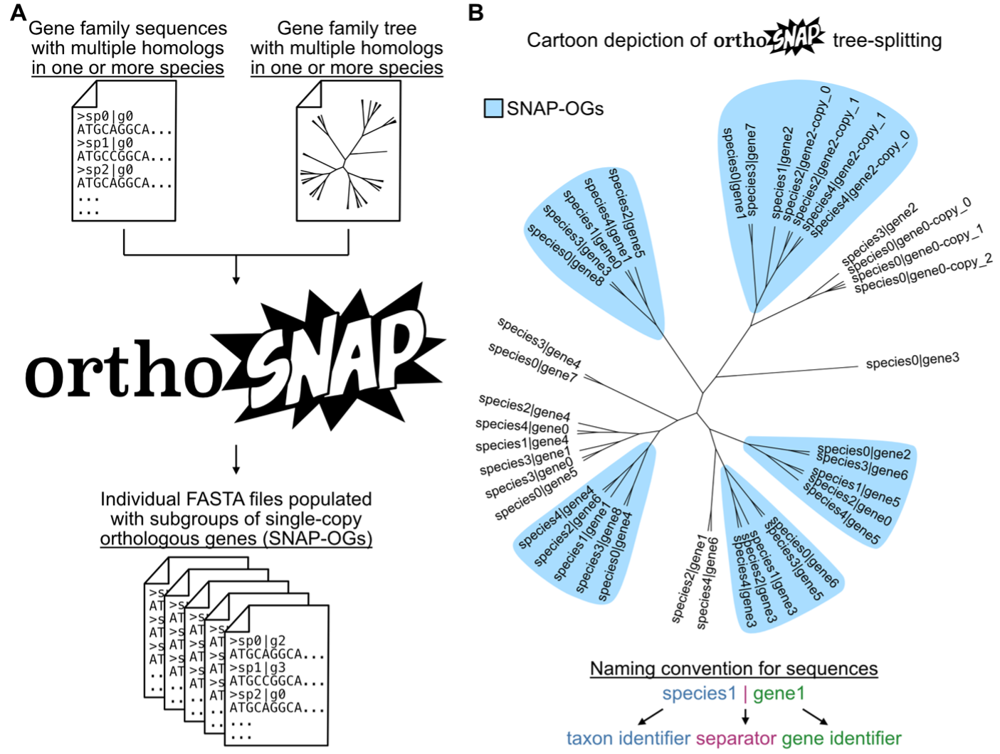

    
    

    <a href="https://console.latch.bio/explore/60254/info">
    Click here to see the workflow! 
    </a>
      
    
    

 

# OrthoSNAP: a tree splitting and pruning algorithm for retrieving single-copy orthologs from gene family trees
## About
OrthoSNAP is a command-line tool for increasing the size of molecular evolution datasets that can then be used for diverse studies including phylogenomics and genome-wide surveys of selection.

 

Molecular evolution studies, such as phylogenomic studies and genome-wide surveys of selection, often rely on gene families of single-copy orthologs (SC-OGs). Large gene families with multiple homologs in one or more species are often ignored because identifying and retrieving SC-OGs nested within them is challenging. To address this issue and increase the number of markers used in molecular evolution studies, we developed OrthoSNAP, a software that uses a phylogenetic framework to simultaneously split gene families into SC-OGs and prune species-specific inparalogs. We term SC-OGs identified by OrthoSNAP as SNAP-OGs because they are identified using a splitting and pruning procedure (analogous to snapping branches on a tree). OrthoSNAP is useful for increasing the number of markers used in molecular evolution data matrices, a critical step for robustly inferring and exploring the tree of life.

 

## Depiction of OrthoSNAP workflow

(A) OrthoSNAP takes as input two files: a FASTA file of a gene family with multiple homologs observed in one or more species and the associated gene family tree. The outputted file(s) will be individual FASTA files of SNAP-OGs. (B) A cartoon phylogenetic tree that depicts the evolutionary history of a gene family and five SNAP-OGs therein. While identifying SNAP-OGs, OrthoSNAP also identifies and prunes species-specific inparalogs (e.g., species2|gene2-copy_0 and species2|gene2-copy_1), retaining only the inparalog with the longest sequence, a practice common in transcriptomics. Note, OrthoSNAP requires that sequence naming schemes must be the same in both sequences and follow the convention in which a taxon identifier and gene identifier are separated by pipe (or vertical bar; “|”) character. 

 

## Citation

If you found OrthoSNAP useful, please cite *OrthoSNAP: a tree splitting and pruning algorithm for retrieving single-copy orthologs from gene family trees*. Steenwyk et al. 2021,
bioRxiv. doi:
[10.1101/2021.10.30.466607v1](https://www.biorxiv.org/content/10.1101/2021.10.30.466607v1).

